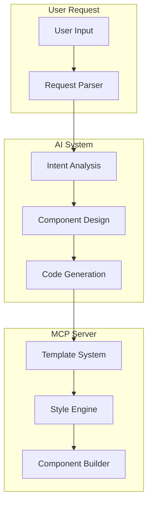
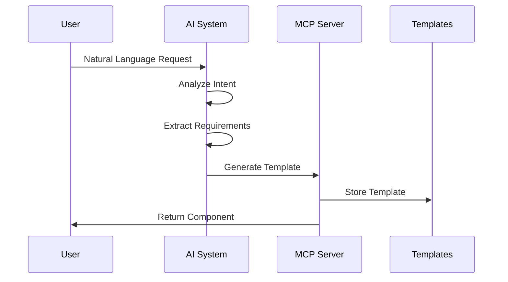
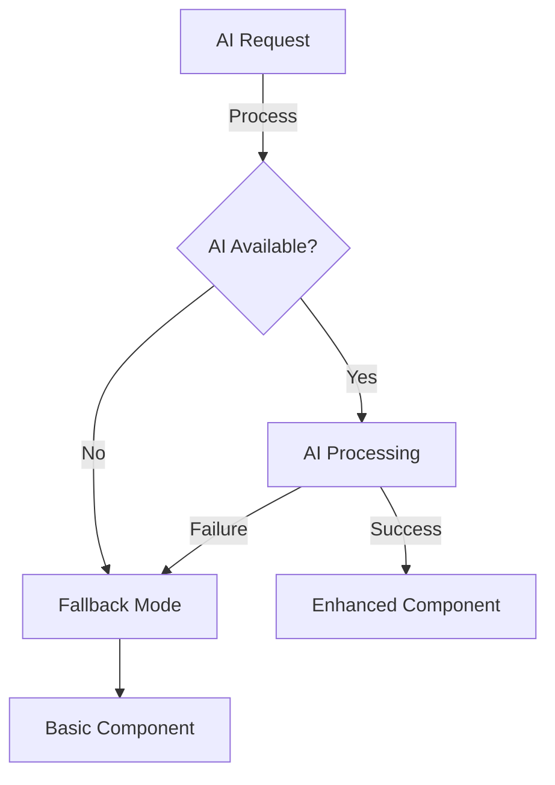

# AI + MCP Server Integration

## Architecture Overview



## 1. Integration Approaches

### A. AI-First Approach

```typescript
interface AIComponentRequest {
  description: string; // Natural language description
  requirements?: string[]; // Specific requirements
  context?: string; // Usage context
  preferences?: {
    style?: string; // Design preferences
    behavior?: string; // Interaction preferences
  };
}

// Example:
const request = {
  description: 'Create a notification card for displaying alerts',
  requirements: [
    'Should support different alert types (info, warning, error)',
    'Include a close button',
    'Animate on entry',
  ],
  preferences: {
    style: 'modern and minimal',
    behavior: 'fade out after 5 seconds',
  },
};
```

### B. Hybrid Approach

```typescript
interface HybridRequest {
  // Standard MCP fields
  type?: string;
  variant?: string;
  props?: Record<string, any>;

  // AI enhancement fields
  enhance?: {
    description?: string; // Additional requirements
    customize?: string[]; // Customization requests
    adapt?: string; // Adaptation context
  };
}

// Example:
const request = {
  type: 'card',
  variant: 'primary',
  enhance: {
    description: 'Make it more compact and modern',
    customize: ['add hover effects', 'smooth transitions'],
    adapt: 'mobile-friendly',
  },
};
```

## 2. AI Processing Pipeline



### Intent Analysis

```typescript
interface IntentAnalysis {
  componentType: string;
  features: string[];
  styling: StylePreferences;
  behavior: BehaviorSpecs;
  constraints: string[];
}

class AIAnalyzer {
  async analyzeIntent(request: AIComponentRequest): Promise<IntentAnalysis> {
    // Use AI to understand requirements
    const analysis = await this.ai.analyze(request.description);

    // Extract key features
    const features = this.extractFeatures(analysis);

    // Determine styling preferences
    const styling = this.determineStyle(request.preferences?.style, analysis);

    return {
      componentType: analysis.suggestedType,
      features,
      styling,
      behavior: this.analyzeBehavior(request, analysis),
      constraints: this.extractConstraints(analysis),
    };
  }
}
```

## 3. Component Generation

### A. AI-Enhanced Templates

```typescript
interface AIEnhancedTemplate extends Template {
  aiMetadata: {
    purpose: string;
    usageContext: string[];
    adaptations: string[];
  };
  enhance: (request: EnhancementRequest) => Promise<Template>;
}

class AITemplateEnhancer {
  async enhance(template: Template, requirements: string[]): Promise<Template> {
    // Analyze current template
    const analysis = await this.analyzeTemplate(template);

    // Generate improvements
    const enhancements = await this.generateEnhancements(analysis, requirements);

    // Apply enhancements
    return this.applyEnhancements(template, enhancements);
  }
}
```

### B. Dynamic Style Generation

```typescript
class AIStyleGenerator {
  async generateStyles(preferences: StylePreferences): Promise<string[]> {
    // Convert preferences to DaisyUI classes
    const baseClasses = await this.ai.convertToClasses(preferences);

    // Optimize class combinations
    return this.optimizeClasses(baseClasses);
  }
}
```

## 4. Error Handling & Fallbacks



### Fallback Strategy

```typescript
class AIFallbackHandler {
  async handleFailure(error: AIError, request: ComponentRequest): Promise<Component> {
    // Log AI failure
    this.logError(error);

    // Convert to basic request
    const basicRequest = this.convertToBasic(request);

    // Use standard MCP generation
    return this.mcp.generateComponent(basicRequest);
  }
}
```

## 5. Implementation Example

### Smart Component Generation

```typescript
class SmartComponentGenerator {
  async generate(request: any): Promise<string> {
    // Determine if AI processing needed
    if (this.needsAI(request)) {
      try {
        // AI-enhanced generation
        return await this.aiGenerate(request);
      } catch (error) {
        // Fallback to standard generation
        return await this.standardGenerate(request);
      }
    }

    // Standard component generation
    return await this.standardGenerate(request);
  }

  private async aiGenerate(request: AIComponentRequest): Promise<string> {
    // Analyze intent
    const intent = await this.ai.analyzeIntent(request);

    // Generate or enhance template
    const template = await this.getTemplate(intent);

    // Apply AI-generated styles
    const styles = await this.ai.generateStyles(intent.styling);

    // Generate component
    return this.generator.generate(template, styles);
  }
}
```

## 6. Benefits & Considerations

### Benefits

1. Natural language component creation
2. Intelligent style suggestions
3. Context-aware adaptations
4. Dynamic template enhancement
5. Automated optimization

### Considerations

1. AI service availability
2. Response time management
3. Fallback mechanism
4. Cache strategy
5. Cost optimization

## 7. Usage Examples

```typescript
// 1. Natural Language Request
const cardComponent = await generator.create(
  'Create a product card with image, price, and buy button'
);

// 2. Enhanced Standard Component
const enhancedButton = await generator.create({
  type: 'button',
  enhance: {
    description: 'Make it more modern and interactive',
    customize: ['add hover effects', 'smooth transitions'],
  },
});

// 3. Style Generation
const styles = await generator.generateStyles('modern, minimalist, with subtle animations');
```
