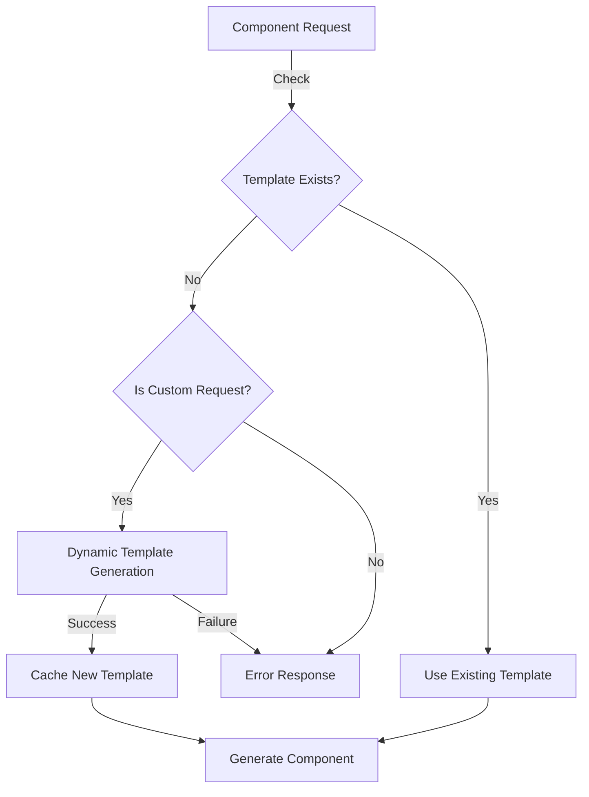

# Handling Non-Existent Components

## Flow Diagram



## 1. Custom Component Strategy

### Request Format

```typescript
interface CustomComponentRequest {
  type: string;
  structure: {
    tag: string; // HTML element to use
    baseClasses?: string[]; // Base DaisyUI classes
    variants?: {
      // Custom variants
      [key: string]: string[];
    };
    props?: PropDefinition[]; // Component props
    children?: boolean; // Whether component accepts children
  };
}

// Example:
const customCard = {
  type: 'product-card',
  structure: {
    tag: 'div',
    baseClasses: ['card', 'card-compact'],
    variants: {
      featured: ['bg-primary', 'text-primary-content'],
      basic: ['bg-base-100', 'shadow-xl'],
    },
    props: [
      { name: 'title', type: 'string', required: true },
      { name: 'price', type: 'number', required: true },
      { name: 'image', type: 'string', required: false },
    ],
    children: true,
  },
};
```

## 2. Resolution Process

### Step 1: Template Check

```typescript
class TemplateResolver {
  async resolveTemplate(request: ComponentRequest): Promise<Template> {
    // 1. Check existing templates
    const existing = await this.templateStore.get(request.type);
    if (existing) return existing;

    // 2. Check if custom request
    if (this.isCustomRequest(request)) {
      return this.generateCustomTemplate(request);
    }

    // 3. Throw error for unsupported components
    throw new ComponentError(
      'TEMPLATE_NOT_FOUND',
      `No template found for component type: ${request.type}`
    );
  }
}
```

### Step 2: Custom Template Generation

```typescript
class CustomTemplateGenerator {
  generateTemplate(request: CustomComponentRequest): Template {
    return {
      id: request.type,
      base: this.generateBaseStructure(request),
      variants: this.processVariants(request.structure.variants),
      props: this.processProps(request.structure.props),
      validation: this.generateValidation(request),
    };
  }

  private generateBaseStructure(request: CustomComponentRequest): string {
    const { tag, baseClasses, children } = request.structure;
    return `
      export const ${this.formatComponentName(request.type)} = ({
        ${this.generatePropsList(request.structure.props)},
        className,
        ${children ? 'children,' : ''}
        ...props
      }) => (
        <${tag} 
          className={\`${baseClasses.join(' ')} \${className}\`}
          {...props}
        >
          ${this.generateContentTemplate(request)}
        </${tag}>
      );
    `;
  }
}
```

## 3. Error Handling

### Error Types

```typescript
type CustomComponentError =
  | 'INVALID_STRUCTURE'
  | 'INVALID_TAG'
  | 'INVALID_CLASSES'
  | 'VALIDATION_FAILED';

interface CustomComponentErrorDetails {
  code: CustomComponentError;
  message: string;
  field?: string;
  suggestion?: string;
}
```

### Error Handler

```typescript
class CustomComponentErrorHandler {
  handleError(error: unknown): ComponentResponse {
    if (error instanceof ValidationError) {
      return this.provideErrorGuidance(error);
    }
    return this.generalError(error);
  }

  private provideErrorGuidance(error: ValidationError): ComponentResponse {
    return {
      success: false,
      error: {
        message: error.message,
        suggestion: this.getSuggestion(error),
        examples: this.getExamples(error.code),
      },
    };
  }
}
```

## 4. Examples

### Basic Custom Component

```typescript
// Request
const request = {
  type: "info-box",
  structure: {
    tag: "div",
    baseClasses: ["bg-base-200", "p-4", "rounded-lg"],
    variants: {
      warning: ["bg-warning", "text-warning-content"],
      info: ["bg-info", "text-info-content"]
    },
    props: [
      { name: "title", type: "string", required: true },
      { name: "message", type: "string", required: true }
    ]
  }
};

// Generated Component
export const InfoBox = ({
  title,
  message,
  className,
  variant = 'info',
  ...props
}) => (
  <div
    className={`bg-base-200 p-4 rounded-lg ${
      variant === 'warning'
        ? 'bg-warning text-warning-content'
        : 'bg-info text-info-content'
    } ${className}`}
    {...props}
  >
    <h3 className="font-bold">{title}</h3>
    <p>{message}</p>
  </div>
);
```

### Complex Custom Component

```typescript
// Request
const request = {
  type: "data-card",
  structure: {
    tag: "div",
    baseClasses: ["card", "shadow-xl"],
    variants: {
      compact: ["card-compact"],
      side: ["card-side"]
    },
    props: [
      { name: "header", type: "ReactNode" },
      { name: "footer", type: "ReactNode" },
      { name: "loading", type: "boolean" }
    ],
    children: true
  }
};

// Generated Component
export const DataCard = ({
  header,
  footer,
  loading,
  className,
  variant,
  children,
  ...props
}) => (
  <div
    className={`card shadow-xl ${
      variant === 'compact'
        ? 'card-compact'
        : variant === 'side'
          ? 'card-side'
          : ''
    } ${className}`}
    {...props}
  >
    {loading ? (
      <div className="card-body animate-pulse">
        <div className="h-4 bg-base-300 rounded w-3/4"></div>
        <div className="h-32 bg-base-300 rounded"></div>
      </div>
    ) : (
      <>
        {header && (
          <div className="card-header p-4">{header}</div>
        )}
        <div className="card-body">{children}</div>
        {footer && (
          <div className="card-footer p-4">{footer}</div>
        )}
      </>
    )}
  </div>
);
```
