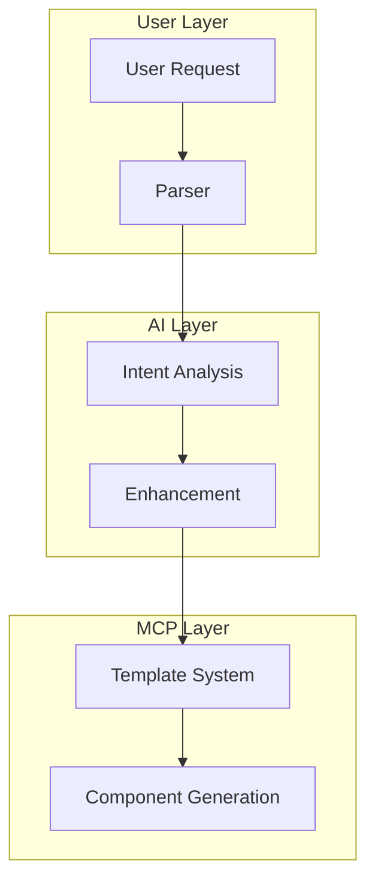

# Technical System Design

[Previous content remains unchanged through Section 8...]

## 9. AI Integration



For detailed AI integration implementation, see [AI_INTEGRATION.md](./AI_INTEGRATION.md).

### Integration Points

```typescript
class ComponentService {
  async generate(request: ComponentRequest): Promise<string> {
    try {
      // Check if AI enhancement requested
      if (this.shouldUseAI(request)) {
        return this.aiEnhancedGeneration(request);
      }

      // Standard generation
      const template = await this.templateEngine.get(request.type);
      if (template) {
        return this.generateFromTemplate(template, request);
      }

      // Custom component handling
      if (this.isCustomRequest(request)) {
        return this.handleCustomComponent(request);
      }

      throw new ComponentError('TEMPLATE_NOT_FOUND', `Component type "${request.type}" not found`);
    } catch (error) {
      this.errorHandler.handle(error);
    }
  }

  private async aiEnhancedGeneration(request: ComponentRequest): Promise<string> {
    // AI processing with fallback to standard generation
    try {
      const enhancement = await this.aiService.enhance(request);
      return this.generateWithEnhancement(enhancement);
    } catch (error) {
      console.warn('AI enhancement failed, falling back to standard generation');
      return this.generate({
        ...request,
        useAI: false,
      });
    }
  }
}
```

## 10. Implementation Phases

### Phase 1: Core (Day 1)

1. MCP server setup
2. Basic template system
3. Simple component generation
4. Error handling foundation

### Phase 2: Features (Day 2)

1. Style engine
2. Props handling
3. Custom component support
4. Template caching
5. Basic AI integration

### Phase 3: Advanced Features (Day 3)

1. Enhanced AI capabilities
2. Performance optimization
3. Complex components
4. Advanced error handling
5. Documentation and examples

### Phase 4: Polish (Day 4)

1. Testing
2. Performance tuning
3. Documentation updates
4. Example gallery
5. Deployment preparation
