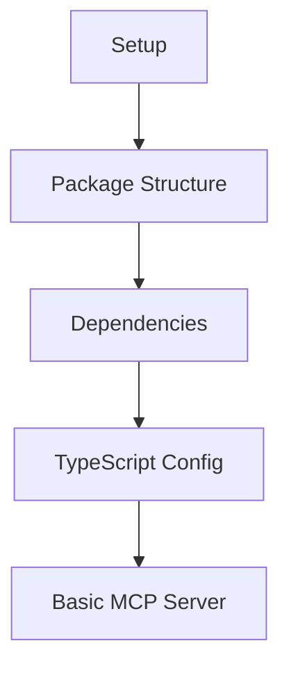
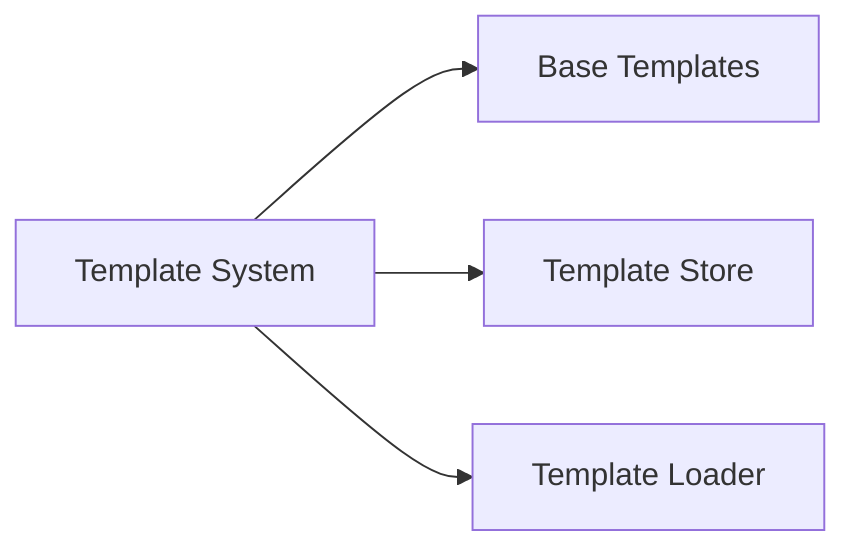
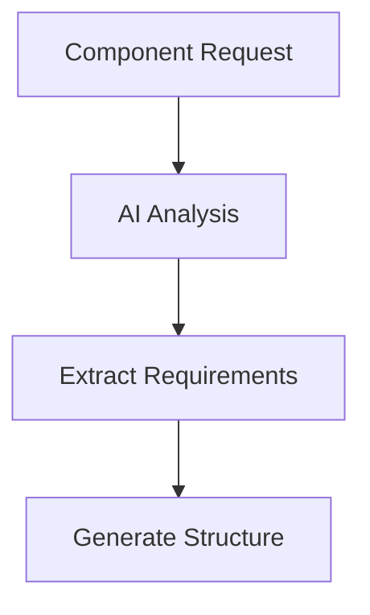
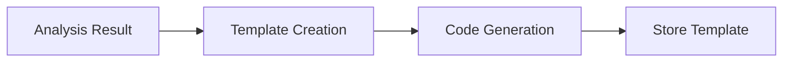
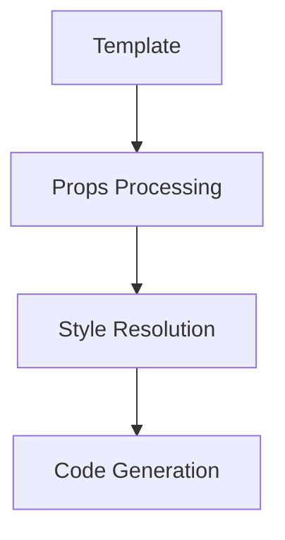
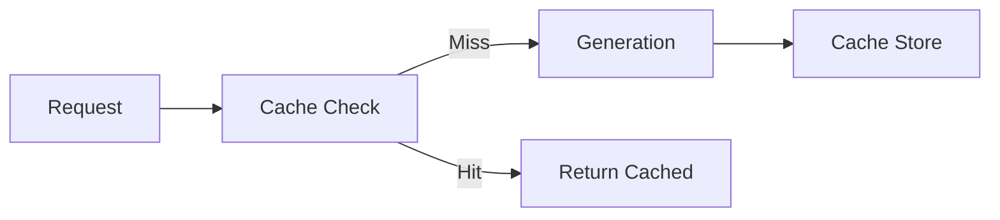

# Implementation Plan: AI Custom Component Generator

## Phase 1: Core Setup (Day 1 Morning)

### 1. Project Infrastructure (2 hours)

- [x] Initialize package structure

  - [x] Create src directory structure
  - [x] Set up TypeScript configuration
  - [x] Configure build process

- [x] Install core dependencies

  - [x] @modelcontextprotocol/sdk
  - [x] typescript
  - [x] daisyui
  - [x] jest for testing

- [~] Create basic MCP server
  - [x] Server class setup
  - [~] Basic error handling
  - [~] Connection handling

### 2. Template System (2 hours)

- [x] Create template interfaces

  - [x] Define Template type
  - [x] Create PropDefinition type
  - [x] Set up validation rules

- [x] Implement template store

  - [x] Create storage mechanism
  - [x] Add CRUD operations
  - [~] Set up caching layer

- [~] Add template loading
  - [x] File system loader
  - [~] Memory cache
  - [~] Error handling

## Phase 2: AI Integration (Day 1 Afternoon)

### 1. AI Analysis System (2 hours)

- [x] Create AI analyzer

  - [x] Setup request processing
  - [x] Implement requirement extraction
  - [x] Add structure generation

- [~] Add validation
  - [x] Input validation
  - [~] Output validation
  - [~] Error handling

### 2. Template Generation (2 hours)

- [x] Implement template generator

  - [x] Create base structure
  - [x] Add prop handling
  - [~] Implement style system

- [~] Add code generation
  - [x] TypeScript code generation
  - [~] DaisyUI class integration
  - [~] Props validation

## Phase 3: Core Features (Day 2 Morning)

### 1. Component Generation (2 hours)

- [ ] Implement component generator

  - [ ] Setup generation pipeline
  - [ ] Add prop processing
  - [ ] Create style resolver

- [ ] Add style system
  - [ ] DaisyUI class handling
  - [ ] Style combination
  - [ ] Class optimization

### 2. Caching System (2 hours)

- [ ] Implement caching

  - [ ] Setup cache store
  - [ ] Add cache invalidation
  - [ ] Implement cache strategy

- [ ] Add optimization
  - [ ] Template caching
  - [ ] Generated code caching
  - [ ] Performance monitoring

## Phase 4: Testing & Documentation (Day 2 Afternoon)

### 1. Testing (2 hours)

- [ ] Unit tests

  - [ ] Template generation
  - [ ] AI analysis
  - [ ] Component generation

- [ ] Integration tests
  - [ ] Full pipeline testing
  - [ ] Error handling
  - [ ] Edge cases

### 2. Documentation (2 hours)

- [ ] API documentation

  - [ ] Usage examples
  - [ ] Error handling
  - [ ] Best practices

- [ ] Example components
  - [ ] Basic examples
  - [ ] Complex examples
  - [ ] Edge cases

## Implementation Guidelines

### 1. Task Execution

- Start with minimal working implementation
- Add features iteratively
- Test each component individually
- Document as you go

### 2. Code Quality

- Use TypeScript for type safety
- Follow project style guide
- Add comprehensive error handling
- Include unit tests

### 3. Review Process

- Test generated components
- Verify error handling
- Check performance
- Update documentation

### 4. Success Criteria

- Components generate successfully
- Templates are cached properly
- Error handling works correctly
- Documentation is complete

## Progress Tracking

Use check boxes to track completion:

- [ ] Task not started
- [x] Task completed
- [~] Task in progress

Update this document as tasks are completed to maintain clear progress visibility.
