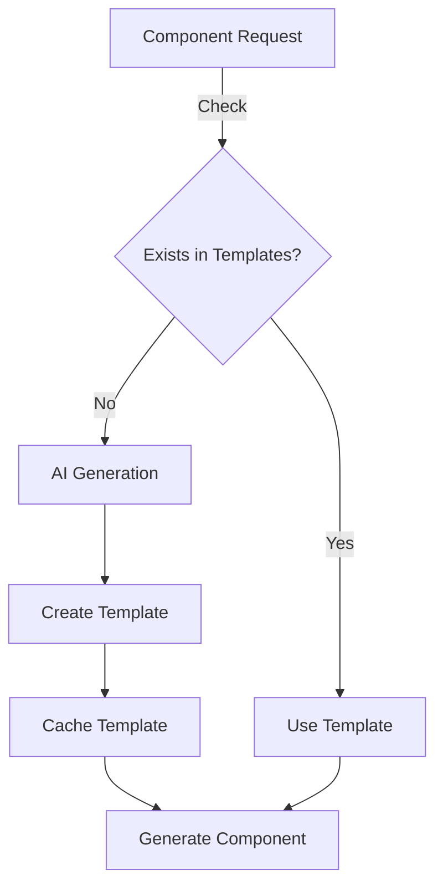

# React Component Generator

An MCP server that generates React components with DaisyUI integration, focusing on handling non-existent and custom components using AI.

## Core Features



## Usage

1. Standard Component:

```typescript
const button = await generate({
  type: 'button',
  variant: 'primary',
});
```

2. Custom Component:

```typescript
const productCard = await generate({
  description: 'Create a product card with image, title, price and buy button',
});
```

## Component Generation

### Template Creation

```typescript
// AI analyzes request and creates appropriate template
const template = await ai.createTemplate(
  "Product card with image, title, and price"
);

// Generated component example
export const ProductCard = ({
  title,
  price,
  image,
  className,
  ...props
}) => (
  <div className={`card card-compact shadow-lg ${className}`} {...props}>
    <figure></figure>
    <div className="card-body">
      <h2 className="card-title">{title}</h2>
      <p className="text-xl">${price}</p>
    </div>
  </div>
);
```

## Project Structure

```
craftsman/
├── src/
│   ├── index.ts        # MCP server
│   ├── ai/            # AI integration
│   ├── templates/     # Component templates
│   └── utils/        # Utilities
├── tests/            # Test files
└── examples/         # Usage examples
```

## Documentation

- [Design Documentation](./DESIGN.md) - System architecture and implementation
- [DaisyUI Core](./DAISYUI_CORE.md) - DaisyUI patterns and usage
- [AI Custom Components](./AI_CUSTOM_COMPONENTS.md) - AI component generation

## Setup

```bash
# Install
npm install

# Build
npm run build

# Run
npm start
```

## Next Steps

1. Set up MCP server
2. Implement AI component analysis
3. Add template generation
4. Create caching system
5. Add example components
