# React AI Guide

A practical system for enhancing React development with AI tools, optimized for Cursor.

## 🎯 Purpose

React AI Guide provides a lightweight, practical framework that helps developers:

- **Accelerate development** with AI-optimized patterns and prompts
- **Maintain consistency** through clearly defined rules and standards
- **Improve quality** with best practices and validation tools
- **Reduce cognitive load** by providing ready-to-use solutions

Unlike complex frameworks or assistants that require extensive infrastructure, this system focuses on practical documentation, patterns, and simple tools that integrate seamlessly with existing workflows and AI coding assistants like Cursor.

## 🏗️ System Architecture

```mermaid
graph TD
    A[React AI Guide] --> B[Patterns]
    A --> C[Rules]
    A --> D[Prompts]
    A --> E[Scripts]
    A --> F[Templates]
    A --> G[Tools]

    B --> B1[Component Patterns]
    B --> B2[Hook Patterns]
    B --> B3[State Patterns]
    B --> B4[Architecture Patterns]

    C --> C1[Code Rules]
    C --> C2[Quality Rules]
    C --> C3[TypeScript Rules]

    D --> D1[Generation Prompts]
    D --> D2[Refactoring Prompts]
    D --> D3[Assistance Prompts]

    E --> E1[Generation Scripts]
    E --> E2[Validation Scripts]
    E --> E3[Documentation Scripts]

    F --> F1[Component Templates]
    F --> F2[Hook Templates]
    F --> F3[Test Templates]

    G --> G1[CLI Tools]
    G --> G2[Editor Integration]
```



## 🚀 Getting Started

### 1. Basic Setup

```bash
# Clone the repository
git clone https://github.com/your-org/react-ai-guide.git

# Navigate to the project
cd react-ai-guide

# Install dependencies (if applicable)
npm install
```

### 2. Start Using Patterns

Browse the pattern library to find solutions for common React development tasks:

- **Component Patterns**: Reusable UI component structures
- **Hook Patterns**: Custom hook implementations for various use cases
- **State Patterns**: Effective state management approaches

### 3. Apply Development Rules

Follow the established rules to ensure code quality and consistency:

- **Code Rules**: Naming, structure, and organization
- **Quality Rules**: Testing, performance, and accessibility
- **TypeScript Rules**: Type definitions and interfaces

### 4. Leverage AI Prompts

Use the optimized prompts with Cursor or other AI tools:

- **Generation Prompts**: Create components, hooks, and tests
- **Refactoring Prompts**: Improve existing code
- **Assistance Prompts**: Get help with debugging and understanding

## 📚 Documentation

The system includes comprehensive documentation:

- [Introduction](./docs/overview/INTRODUCTION.md): System philosophy and goals
- [Getting Started](./docs/user-guides/GETTING_STARTED.md): Quick start guide
- [Workflow Guide](./docs/user-guides/WORKFLOW_GUIDE.md): Recommended development workflow
- [Cursor Integration](./docs/user-guides/CURSOR_INTEGRATION.md): Using with Cursor AI
- [Architecture](./docs/overview/ARCHITECTURE.md): System architecture details

## 🧩 Core Components

### Patterns

[Patterns](./patterns/) provide reusable solutions for common React development challenges:

- **[Component Patterns](./patterns/components/)**: UI component structures and implementations
- **[Hook Patterns](./patterns/hooks/)**: Custom React hooks for various use cases
- **[State Patterns](./patterns/state/)**: State management approaches and implementations
- **[Architecture Patterns](./patterns/architecture/)**: Project structure and organization patterns

### Rules

[Rules](./rules/) define standards and best practices:

- **[Code Rules](./rules/code/)**: Naming, structure, and organization guidelines
- **[Quality Rules](./rules/quality/)**: Testing, performance, and accessibility standards
- **[TypeScript Rules](./rules/typescript/)**: Type definition and usage standards

### Prompts

[Prompts](./prompts/) provide optimized instructions for AI assistants:

- **[Generation Prompts](./prompts/generation/)**: Creating components, hooks, and tests
- **[Refactoring Prompts](./prompts/refactoring/)**: Improving existing code
- **[Assistance Prompts](./prompts/assistance/)**: Getting help with debugging and understanding

### Scripts and Tools

The system includes simple automation tools:

- **[Scripts](./scripts/)**: Automation for common tasks
- **[Templates](./templates/)**: Starter files for various purposes
- **[Tools](./tools/)**: CLI tools and editor integrations

## 🤝 Contributing

We welcome contributions to enhance the system:

- Add new patterns and rules
- Improve documentation
- Create additional tools and scripts

Please see our [Contribution Guidelines](./CONTRIBUTING.md) for more information.

## 📋 Roadmap

See our [Roadmap](./docs/overview/ROADMAP.md) for planned enhancements and future directions.

## 📄 License

This project is licensed under the MIT License - see the [LICENSE](./LICENSE) file for details. 