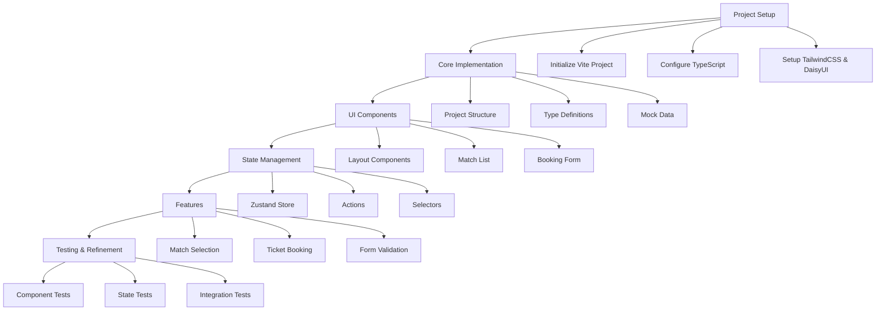

# Football Ticket Booking Application Implementation Plan

## AI Tooling Integration

The implementation follows the AI Tooling system's rule-based approach for consistent, high-quality development. This integration enables:

- Automated context loading for development
- Pattern-based implementation
- Rule-driven quality validation
- AI-optimized documentation

## Architecture Overview



## 1. Project Setup

- Initialize new Vite + React + TypeScript project in packages/react-app/
- Setup TailwindCSS and DaisyUI
- Configure TypeScript and ESLint settings
- Update package.json with required dependencies

### Development Workflow

- Use pnpm for package management
- Configure husky for pre-commit hooks
  - Lint
  - Type check
  - Run unit tests
- Setup GitHub Actions for CI/CD
  - Build verification
  - Test execution
  - PR checks

## 2. Project Structure

```
packages/react-app/
├── ai-tooling/          # AI Tooling Integration
│   ├── rules/          # Implementation rules
│   │   ├── basic/     # Basic development rules
│   │   ├── code/      # Code-specific rules
│   │   └── docs/      # Documentation rules
│   ├── patterns/      # Common implementation patterns
│   │   ├── components/# Component patterns
│   │   ├── state/     # State management patterns
│   │   └── testing/   # Testing patterns
│   └── quality/       # Quality validation system
├── src/
│   ├── components/    # Reusable UI components
│   │   ├── layout/   # Layout components
│   │   ├── matches/  # Match-related components
│   │   └── booking/  # Booking-related components
│   ├── types/        # TypeScript interfaces
│   ├── store/        # Zustand store
│   ├── data/         # Mock data
│   ├── utils/        # Helper functions
│   ├── hooks/        # Custom hooks
│   ├── constants/    # App constants
│   ├── services/     # API services
│   └── App.tsx       # Root component
├── tests/
│   ├── unit/        # Unit tests
│   ├── integration/ # Integration tests
│   └── e2e/        # End-to-end tests
```

## 3. Core Types

```typescript
interface Match {
  id: string;
  homeTeam: string;
  awayTeam: string;
  date: string;
  venue: string;
  availableTickets: number;
  price: number;
  category?: string;
  description?: string;
}

interface Booking {
  id: string;
  matchId: string;
  quantity: number;
  totalPrice: number;
  customerName: string;
  customerEmail: string;
  bookingDate: string;
  status: 'pending' | 'confirmed' | 'cancelled';
}

interface AppState {
  matches: Match[];
  selectedMatch: Match | null;
  bookings: Booking[];
  isLoading: boolean;
  error: string | null;
  filters: {
    date?: string;
    team?: string;
    priceRange?: [number, number];
  };
}
```

## 4. Key Components

### Layout Components

- `Layout`: Main app layout with responsive design
- `Navbar`: Navigation with filters
- `Footer`: App footer with links

### Match Components

- `MatchList`: Displays available matches
  - Implements virtual scrolling for performance
  - Supports sorting and filtering
- `MatchCard`: Individual match display
  - Responsive design
  - Loading skeleton
- `MatchFilters`: Filter controls

### Booking Components

- `BookingForm`: Ticket booking form with validation
  - Form validation using react-hook-form
  - Real-time price calculation
  - Quantity limits
- `BookingConfirmation`: Booking success view
- `ErrorAlert`: Error display component

## 5. State Management (Zustand)

```typescript
interface TicketStore {
  // State
  matches: Match[];
  selectedMatch: Match | null;
  bookings: Booking[];
  isLoading: boolean;
  error: string | null;
  filters: {
    date?: string;
    team?: string;
    priceRange?: [number, number];
  };

  // Actions
  selectMatch: (match: Match) => void;
  bookTickets: (booking: Omit<Booking, 'id'>) => Promise<void>;
  fetchMatches: () => Promise<void>;
  applyFilters: (filters: Partial<AppState['filters']>) => void;
  cancelBooking: (bookingId: string) => Promise<void>;

  // Selectors
  getFilteredMatches: () => Match[];
  getMatchById: (id: string) => Match | undefined;
  getUserBookings: (email: string) => Booking[];
}

// Local Storage Strategy
- Persist bookings and user preferences
- Cache match data for offline support
- Clear sensitive data on logout
```

## 6. Implementation Phases

### Phase 1: AI-Driven Setup and UI (MVP)

- Project initialization with AI Tooling rules
  - Apply Basic Rules for project structure
  - Configure automated context loading
  - Setup rule validation system
- Layout implementation following patterns
  - Use component templates
  - Apply Common Patterns
  - Validate against rules
- Basic components with automated validation
  - Pattern-based component development
  - Automated quality checks
  - Rule compliance verification
- Mobile-first responsive design with pattern validation

### Phase 2: Pattern-Based State Management

- Zustand store setup following state patterns
  - Apply state management patterns
  - Implement automated validation
  - Follow rule-based architecture
- Core actions implementation with validation
  - Pattern-based action design
  - Automated testing setup
  - Rule compliance checks
- State persistence with quality validation
  - Pattern-based storage
  - Automated persistence checks
  - Rule-based optimization
- Offline support with automated validation

### Phase 3: Rule-Driven Features

- Match listing and filtering
  - Apply list pattern templates
  - Automated performance checks
  - Rule-based optimization
- Booking form with pattern validation
  - Use form patterns
  - Automated validation
  - Rule compliance
- Success/error handling with pattern matching
  - Error pattern implementation
  - Automated error checks
  - Rule-based responses
- Accessibility implementation with validation
  - Pattern-based ARIA implementation
  - Automated accessibility checks
  - Rule compliance verification

### Phase 4: Pattern-Based Performance Optimization

- Component optimization following patterns
  - Pattern-based code splitting
  - Automated splitting decisions
  - Rule compliance validation
- Resource optimization
  - Image optimization patterns
  - Lazy loading templates
  - Automated optimization checks
- Performance patterns
  - Virtual scrolling implementation
  - Memoization strategies
  - Bundle size reduction patterns
- Automated performance validation
  - Performance metrics tracking
  - Pattern compliance checks
  - Rule-based optimizations

### Phase 5: AI-Enhanced Testing & Documentation

- Pattern-driven testing strategy
  - Rule-based unit test templates
  - Integration test patterns
  - E2E test automation
- AI-optimized documentation
  - Pattern-based documentation
  - Automated doc generation
  - Rule compliance checks
- Automated quality assurance
  - Test coverage validation
  - Documentation completeness
  - Pattern implementation verification

## 7. Testing Strategy

### Pattern-Based Unit Tests

- Component testing patterns
  - Rule-compliant rendering tests
  - Pattern-based behavior validation
  - Automated test generation
- Hook testing templates
  - Behavior validation patterns
  - Rule-based test cases
  - Automated coverage checks
- Utility function testing
  - Pattern-based test suites
  - Rule compliance validation
  - Automated edge cases
- Store testing patterns
  - Action test templates
  - State change validation
  - Pattern compliance checks

### Rule-Driven Integration Tests

- Flow testing patterns
  - Booking flow validation
  - Filter interaction tests
  - State persistence checks
- Pattern validation
  - Component interaction tests
  - Data flow verification
  - Error handling patterns
- Automated integration checks
  - Pattern compliance
  - Rule validation
  - Coverage verification

### AI-Enhanced E2E Tests

- Journey testing patterns
  - Complete booking flows
  - Error scenario coverage
  - Mobile interaction tests
- Automated validation
  - Pattern compliance checks
  - Rule-based assertions
  - Coverage verification
- Performance validation
  - Load time patterns
  - Interaction metrics
  - Response time checks

### Automated Performance Tests

- Pattern-based metrics
  - Load time validation
  - Render performance checks
  - State update efficiency
- Rule compliance
  - Performance thresholds
  - Optimization patterns
  - Automated reporting
- Continuous monitoring
  - Pattern deviation alerts
  - Rule violation checks
  - Trend analysis

## 8. Development Timeline

1. AI Tooling Integration & Setup: 2 hours

   - Rule system configuration
   - Pattern system setup
   - Automated validation configuration

2. Pattern-Based Components: 3 hours

   - Component implementation with templates
   - Pattern validation
   - Automated quality checks

3. Rule-Driven State Management: 2 hours

   - Pattern-based store implementation
   - Automated state validation
   - Rule compliance verification

4. Feature Implementation with Patterns: 3 hours

   - Template-based development
   - Continuous validation
   - Rule compliance monitoring

5. Testing & Quality Automation: 2 hours
   - Automated test generation
   - Pattern verification
   - Documentation automation

Total Estimated Time: ~12 hours
(Additional time accounts for AI Tooling integration and automation setup)

## 9. Key Dependencies

```json
{
  "dependencies": {
    "react": "^18.2.0",
    "react-dom": "^18.2.0",
    "zustand": "^5.0.3",
    "react-hook-form": "^7.x",
    "class-variance-authority": "^0.7.0",
    "react-virtual": "^2.x",
    "date-fns": "^2.x",
    "zod": "^3.x"
  },
  "devDependencies": {
    "vite": "^5.x",
    "@vitejs/plugin-react": "^4.x",
    "typescript": "^5.x",
    "tailwindcss": "^4.x",
    "daisyui": "^5.x",
    "@testing-library/react": "^14.x",
    "vitest": "^1.x",
    "cypress": "^13.x",
    "husky": "^8.x",
    "lint-staged": "^15.x"
  }
}
```

## 10. Error Handling Strategy

### Client-Side Errors

- Form validation errors
- Network request failures
- State updates errors
- React error boundaries

### Server-Side Errors

- API response validation
- Rate limiting handling
- Timeout handling
- Retry logic

### User Feedback

- Toast notifications
- Form error messages
- Loading states
- Offline indicators

## 11. Mobile Optimization

### Responsive Design

- Mobile-first approach
- Breakpoint system
- Touch-friendly interactions
- Native-like animations

### Performance

- Image optimization
- Lazy loading
- Minimal bundle size
- Service worker caching

## Next Steps

1. Initialize project structure
2. Set up development environment
3. Begin implementing core components
4. Develop state management solution
5. Implement features
6. Add tests and documentation

## Success Metrics

### Performance Standards

- Page load time < 2s (verified by automated checks)
- First input delay < 100ms (pattern-compliant)
- Time to interactive < 3s (rule-validated)
- Lighthouse score > 90 (automated verification)

### Quality Metrics

- 100% rule compliance (automated validation)
- 95% test coverage (pattern verification)
- Zero pattern violations (continuous monitoring)
- Complete documentation coverage (automated checks)

### Automation Goals

- 90% automated test execution
- 100% pattern implementation
- Full rule system integration
- Automated quality validation
