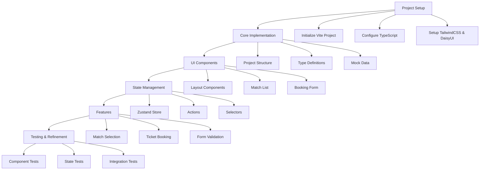

# Football Ticket Booking Application Implementation Plan

## Architecture Overview



## 1. Project Setup

- Initialize new Vite + React + TypeScript project in packages/react-app/
- Setup TailwindCSS and DaisyUI
- Configure TypeScript and ESLint settings
- Update package.json with required dependencies

### Development Workflow

- Use pnpm for package management
- Configure husky for pre-commit hooks
  - Lint
  - Type check
  - Run unit tests
- Setup GitHub Actions for CI/CD
  - Build verification
  - Test execution
  - PR checks

## 2. Project Structure

```
packages/react-app/
├── src/
│   ├── components/        # Reusable UI components
│   │   ├── layout/       # Layout components
│   │   ├── matches/      # Match-related components
│   │   └── booking/      # Booking-related components
│   ├── types/            # TypeScript interfaces
│   ├── store/            # Zustand store
│   ├── data/            # Mock data
│   ├── utils/           # Helper functions
│   ├── hooks/           # Custom hooks
│   ├── constants/       # App constants
│   ├── services/        # API services
│   └── App.tsx          # Root component
├── tests/
│   ├── unit/            # Unit tests
│   ├── integration/     # Integration tests
│   └── e2e/            # End-to-end tests
```

## 3. Core Types

```typescript
interface Match {
  id: string;
  homeTeam: string;
  awayTeam: string;
  date: string;
  venue: string;
  availableTickets: number;
  price: number;
  category?: string;
  description?: string;
}

interface Booking {
  id: string;
  matchId: string;
  quantity: number;
  totalPrice: number;
  customerName: string;
  customerEmail: string;
  bookingDate: string;
  status: 'pending' | 'confirmed' | 'cancelled';
}

interface AppState {
  matches: Match[];
  selectedMatch: Match | null;
  bookings: Booking[];
  isLoading: boolean;
  error: string | null;
  filters: {
    date?: string;
    team?: string;
    priceRange?: [number, number];
  };
}
```

## 4. Key Components

### Layout Components

- `Layout`: Main app layout with responsive design
- `Navbar`: Navigation with filters
- `Footer`: App footer with links

### Match Components

- `MatchList`: Displays available matches
  - Implements virtual scrolling for performance
  - Supports sorting and filtering
- `MatchCard`: Individual match display
  - Responsive design
  - Loading skeleton
- `MatchFilters`: Filter controls

### Booking Components

- `BookingForm`: Ticket booking form with validation
  - Form validation using react-hook-form
  - Real-time price calculation
  - Quantity limits
- `BookingConfirmation`: Booking success view
- `ErrorAlert`: Error display component

## 5. State Management (Zustand)

```typescript
interface TicketStore {
  // State
  matches: Match[];
  selectedMatch: Match | null;
  bookings: Booking[];
  isLoading: boolean;
  error: string | null;
  filters: {
    date?: string;
    team?: string;
    priceRange?: [number, number];
  };

  // Actions
  selectMatch: (match: Match) => void;
  bookTickets: (booking: Omit<Booking, 'id'>) => Promise<void>;
  fetchMatches: () => Promise<void>;
  applyFilters: (filters: Partial<AppState['filters']>) => void;
  cancelBooking: (bookingId: string) => Promise<void>;

  // Selectors
  getFilteredMatches: () => Match[];
  getMatchById: (id: string) => Match | undefined;
  getUserBookings: (email: string) => Booking[];
}

// Local Storage Strategy
- Persist bookings and user preferences
- Cache match data for offline support
- Clear sensitive data on logout
```

## 6. Implementation Phases

### Phase 1: Basic Setup and UI (MVP)

- Project initialization
- Layout implementation
- Basic components with mock data
- Mobile-first responsive design

### Phase 2: State Management

- Zustand store setup
- Core actions implementation
- State persistence
- Offline support

### Phase 3: Features

- Match listing and filtering
- Booking form with validation
- Success/error handling
- Accessibility implementation
  - ARIA labels
  - Keyboard navigation
  - Screen reader support

### Phase 4: Performance Optimization

- Component code splitting
- Image optimization
- Virtual scrolling for lists
- Memoization of expensive computations
- Bundle size optimization

### Phase 5: Testing & Documentation

- Unit tests
- Integration tests
- Performance testing
- Documentation
  - Component storybook
  - API documentation
  - Setup guide

## 7. Testing Strategy

### Unit Tests

- Component rendering tests
- Hook behavior tests
- Utility function tests
- Store action tests

### Integration Tests

- Booking flow
- Filter functionality
- State persistence
- Error handling

### E2E Tests

- Complete booking journey
- Error scenarios
- Mobile responsiveness

### Performance Tests

- Load time metrics
- Component render performance
- State update performance

## 8. Development Timeline

1. Setup & Structure: 1 hour
2. Core Components: 2 hours
3. State Management: 1 hour
4. Feature Implementation: 2 hours
5. Testing & Refinement: 1 hour

Total Estimated Time: ~7 hours

## 9. Key Dependencies

```json
{
  "dependencies": {
    "react": "^18.2.0",
    "react-dom": "^18.2.0",
    "zustand": "^5.0.3",
    "react-hook-form": "^7.x",
    "class-variance-authority": "^0.7.0",
    "react-virtual": "^2.x",
    "date-fns": "^2.x",
    "zod": "^3.x"
  },
  "devDependencies": {
    "vite": "^5.x",
    "@vitejs/plugin-react": "^4.x",
    "typescript": "^5.x",
    "tailwindcss": "^4.x",
    "daisyui": "^5.x",
    "@testing-library/react": "^14.x",
    "vitest": "^1.x",
    "cypress": "^13.x",
    "husky": "^8.x",
    "lint-staged": "^15.x"
  }
}
```

## 10. Error Handling Strategy

### Client-Side Errors

- Form validation errors
- Network request failures
- State updates errors
- React error boundaries

### Server-Side Errors

- API response validation
- Rate limiting handling
- Timeout handling
- Retry logic

### User Feedback

- Toast notifications
- Form error messages
- Loading states
- Offline indicators

## 11. Mobile Optimization

### Responsive Design

- Mobile-first approach
- Breakpoint system
- Touch-friendly interactions
- Native-like animations

### Performance

- Image optimization
- Lazy loading
- Minimal bundle size
- Service worker caching

## Next Steps

1. Initialize project structure
2. Set up development environment
3. Begin implementing core components
4. Develop state management solution
5. Implement features
6. Add tests and documentation

## Success Metrics

- Page load time < 2s
- First input delay < 100ms
- Time to interactive < 3s
- Lighthouse score > 90
- Test coverage > 80%
